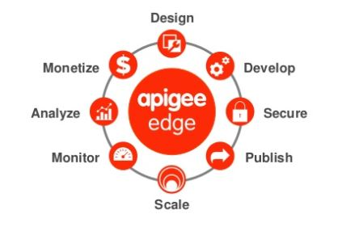
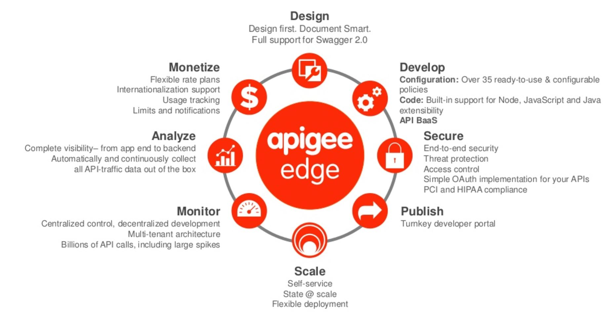
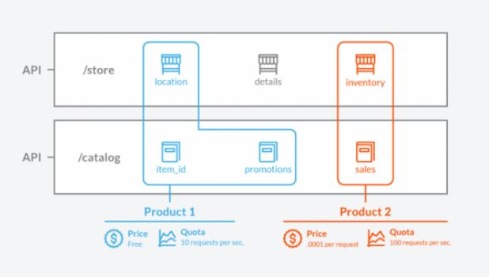
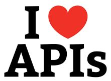

# Arkadin Apigee Workshop

## General presentation

### Google Apigee Edge

### Arkadin architecture

The [plateform](https://myarkadin-my.sharepoint.com/personal/c_cosnefroy_arkadin_com/_layouts/15/onedrive.aspx?id=%2Fpersonal%2Fc_cosnefroy_arkadin_com%2FDocuments%2FArkadin-SolutionArchitecture-20170406-v0%2E1%2Epng&parent=%2Fpersonal%2Fc_cosnefroy_arkadin_com%2FDocuments)

## Practice Apigee

### Create your Apigee account: https://login.apigee.com/sign_up
It's now or never:heavy_exclamation_mark:

### Create your API specification

By using [Apigee](https://apigee.com/specs) or [Swagger](http://editor.swagger.io/#/)

### Create an API proxy from SOAP service

SOAP service for testing: http://www.webservicex.com/New/Home/ServiceDetail/56
The WSDL: http://www.webservicex.com/globalweather.asmx?wsdl

### Create an API proxy from specification

The [Arkadin specifications](https://app.swaggerhub.com/search?query=%20arkadin)

The [JSON specification for the Subsidiaries API](https://app.swaggerhub.com/apiproxy/schema/file/arkadin_api/Subsidiaries/1.0.0/swagger.json)

### Create an REST API proxy 

Use the Rest API: https://jsonplaceholder.typicode.com/

#### Add a quota limit
#### Create a specific endpoint (for the URL /users)
#### Add a JSON-To-XML policy
##### Add a condition on policy
#### Add a apikey verification
In order to use the apikey, explain the publish process (developers, app, product and key).

Please, show me the [video](https://vimeo.com/113342105) (and listen the beautiful music :hear_no_evil:)

##### Create a product
##### Register developers
##### Register apps

### Add an API proxy with Node.js

Node.js tutorial: https://www.w3schools.com/nodejs/
See the version.js file

## Arkadin feedbacks

### Specification
### Mock
### Development
##### Postman, Postman and Postman
### Test
##### Collection runner on Postman
### Production
#### Reports
