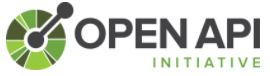
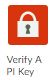

# Arkadin Apigee Workshop

## General presentation

### Google Apigee Edge

### Arkadin architecture

The [plateform](https://myarkadin-my.sharepoint.com/personal/c_cosnefroy_arkadin_com/_layouts/15/onedrive.aspx?id=%2Fpersonal%2Fc_cosnefroy_arkadin_com%2FDocuments%2FArkadin-SolutionArchitecture-20170406-v0%2E1%2Epng&parent=%2Fpersonal%2Fc_cosnefroy_arkadin_com%2FDocuments)

## Practice Apigee

### Create your Apigee account: https://login.apigee.com/sign_up
It's now or never:heavy_exclamation_mark:

### Create your API specification

The [Open API Initiative](https://www.openapis.org/). In 2015 Open API specification = Swagger 2.0 specification.

By using [Apigee](https://apigee.com/specs) or [Swagger](http://editor.swagger.io/#/)

:muscle: It's time to exercise...
Write your specification by using your favorite tool. The specification must describes a new operation called /subsidiaries/countryCode.
Use the [file arkadin_api-Subsidiaries-0.9-swagger.json](./src/arkadin_api-Subsidiaries-0.9-swagger.json)

### Create an API proxy from SOAP service

We're going to retrieve the weather for your city by using the following SOAP service http://www.webservicex.com/New/Home/ServiceDetail/56

Firsly, I'm going to show you :tv: how to do that and secondly it's your turn :white_check_mark:

:muscle: It's time to exercise...
Create an API proxy (SOAP service) with the WSDL URL http://www.webservicex.com/globalweather.asmx?wsdl and test the API with Postman (or your favorite tool).

### Create an API proxy from specification

The [Arkadin specifications](https://app.swaggerhub.com/search?query=%20arkadin)

The [JSON specification for the Subsidiaries API](https://app.swaggerhub.com/apiproxy/schema/file/arkadin_api/Subsidiaries/1.0.0/swagger.json)

:muscle: It's time to exercise...

### Create an REST API proxy 

Use the Rest API: https://jsonplaceholder.typicode.com/

:muscle: It's time to exercise...

#### Add a quota limit 
#### Create a specific endpoint (for the URL /users)
#### Add a JSON-To-XML policy 
##### Add a condition on policy 

:muscle: It's time to exercise...

#### Add a apikey verification 
In order to use the apikey, explain the publish process (developers, app, product and key).

Please, show me the [video](https://vimeo.com/113342105) (and listen the beautiful music :hear_no_evil:)

##### Create a product
##### Register developers
##### Register apps

:muscle: It's time to exercise...

### Add an API proxy with Node.js

Node.js tutorial: https://www.w3schools.com/nodejs/
See the version.js file

:muscle: It's time to exercise...

## Arkadin feedbacks

1. Customers API (production)
2. Subsidiaries API (production)
3. Events API (prototype at the moment, production on September)

### Specification
OpenAPI and Swagger, Apigee isn't enought strong (or not enought finish, as you prefer).

### Mock
Used and approved by Arkadin :thumbsup:

### Development
Easy to use
Easy to understand
Easy to version
You have to know policies and how retrieve the documentation about parameters (because there's a lot of parameters)
I have to draw up a best practices document for my succesors :blue_book:

### Test
##### Postman, Postman and Postman :thumbsup:
##### Collection runner on Postman 
Postman collection runner to automatize tests
But how test the API availability in production:question:

### Production
Several environments :thumbsup:, easy to configure. Load balancing.

#### Reports
To explore in details

