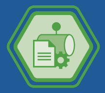
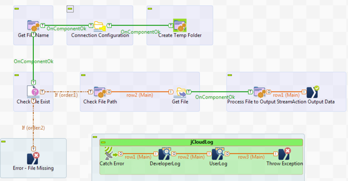
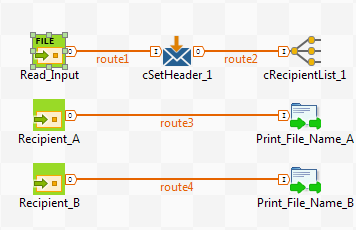

# Arkadin Apigee Workshop

## Quick roundtable (:hourglass: 5')

## General presentation

### Google Apigee Edge (:hourglass: 5')

### Arkadin architecture (:hourglass: 5')

The [platform](https://myarkadin-my.sharepoint.com/personal/c_cosnefroy_arkadin_com/_layouts/15/onedrive.aspx?id=%2Fpersonal%2Fc_cosnefroy_arkadin_com%2FDocuments%2FArkadin-SolutionArchitecture-20170406-v0%2E1%2Epng&parent=%2Fpersonal%2Fc_cosnefroy_arkadin_com%2FDocuments)

## Practice Apigee (:hourglass: 80')

### Create your Apigee account: https://login.apigee.com/sign_up (:hourglass: 5')
It's now or never:heavy_exclamation_mark:

### Create your API specification (:hourglass: 15')

The [Open API Initiative](https://www.openapis.org/). In 2015 Open API specification = Swagger 2.0 specification.

By using [Apigee](https://apigee.com/specs) or [Swagger](http://editor.swagger.io/#/)

:muscle: It's time to exercise...
Write your specification by using your favorite tool (either Apigee or Swagger or another else). The specification must describes a new operation called /subsidiaries/countryCode. This service have to return a list of subsidiaries given a country code (Use the description of others services to describe it).
Use the [file arkadin_api-Subsidiaries-0.9-swagger.json](./src/arkadin_api-Subsidiaries-0.9-swagger.json)

### Create an API proxy from SOAP service (:hourglass: 15')

We're going to retrieve the weather for your city by using the following SOAP service http://www.webservicex.com/New/Home/ServiceDetail/56

Firsly, I'm going to show you :tv: how to do that and secondly it's your turn :white_check_mark:

:muscle: It's time to exercise...
Create an API proxy (SOAP service) with the WSDL URL http://www.webservicex.com/globalweather.asmx?wsdl and test the API with Postman (or your favorite tool).

### Create an API proxy from specification (:hourglass: 5')

You can retrieve the [Arkadin specifications here](https://app.swaggerhub.com/search?query=%20arkadin)

The [JSON specification for the Subsidiaries API](https://app.swaggerhub.com/apiproxy/schema/file/arkadin_api/Subsidiaries/1.0.0/swagger.json)

:muscle: It's time to exercise...
Create the Subsidiaries API proxy from the specification.

### Create an REST API proxy (:hourglass: 30')

Use the Rest API: https://jsonplaceholder.typicode.com/

:muscle: It's time to exercise...
1. Create a reverse proxy
- existing API URL = https://jsonplaceholder.typicode.com/
- secure access = pass through (at the moment) 
2. Test the API
- By using a trace session
3. Add a quota limit policy (the source describing the policy is in [the src directory](./src))

4. Create a specific proxy endpoint (for the URL /users and the HTTP verb GET)
5. Add a JSON-To-XML policy (or a XML-To-JSON :smiling_imp:) to convert the response format in XML

6. Add a condition on policy :trollface: We want to convert the response format (XML or JSON) depending the request header 'Accept'
7. Add a apikey verification 
In order to use the apikey, explain the publish process (developers, app, product and key).

Please, show me the [video](https://vimeo.com/113342105) (and listen the beautiful music :hear_no_evil:) (:hourglass: 3')

##### Create a product
##### Register developers
##### Register apps

:muscle: It's time to exercise...
Ok, I'm a developer, from a partner, and you want to give me an access to your API. My email is c.cosnefroy@arkadin.com and I'm waiting your email with the information needed to use your API.
So, you have to publish your API and give me the elements in order to test the API.

Depending on time we can also:
Add a cache
Add a new proxy endpoint to reset the quota

### Add an API proxy with Node.js (:hourglass: 10')

Node.js tutorial: https://www.w3schools.com/nodejs/
See the version.js file

:muscle: It's time to exercise...
1. Add a new proxy endpoint nammed getVersion (URL /version and HTTP verb GET)
2. Create a new script (Node.js) and copy the version.js file
3. Create a new target endpoint using the Node.js
4. Add a routeRule to redirect the calls to the good endpoind (use the RouteRule snippet in [the src directory](./src))

## Arkadin feedbacks (:hourglass: 15')

### Demonstration of the Arkadin APIs:
1. Customers API (production from today)
2. Subsidiaries API (production from )
3. Events API (prototype at the moment, production on September)

### Specification
OpenAPI and Swagger, Apigee isn't enought strong (or not enought finish, as you prefer).

### Mock
Used and approved by Arkadin :thumbsup:

### Development
Easy to use
Easy to understand
Easy to version
You have to know policies and how retrieve the documentation about parameters (because there're a lot of parameters)
I have to draw up a best practices document for my succesors :blue_book:

### Test
##### Postman, Postman and Postman :thumbsup:
##### Collection runner on Postman 
Postman collection runner to automatize tests
But how test the API availability in production:question:

### Production
Several environments :thumbsup:, easy to configure. Load balancing.

#### Reports
To explore in details

## Questions:question: (:hourglass: 10')

# Arkadin Talend Workshop

## Quick roundtable (:hourglass: 5')

## General presentation

### Talend Data Services Platform (:hourglass: 5')

#### Jobs, services and routes

##### Jobs

##### Services

##### Routes

#### Connectors

### Arkadin architecture (:hourglass: 5')

The [platform](https://myarkadin-my.sharepoint.com/personal/c_cosnefroy_arkadin_com/_layouts/15/onedrive.aspx?id=%2Fpersonal%2Fc_cosnefroy_arkadin_com%2FDocuments%2FArkadin-SolutionArchitecture-20170406-v0%2E1%2Epng&parent=%2Fpersonal%2Fc_cosnefroy_arkadin_com%2FDocuments)

## Practice Talend Data Services Platform (:hourglass: 80')

### Create a job
We're going to create a job with several components in order to glimpse the possibilities of Talend.
This job should:
1. take a XML file with invoice data and billing account,
- Import the XML file in the metadata part.
- Create a new job
- Insert a tFileInputXML, retrieve the description from the metadata
2. Retrieve the subsidiaries given the billing account
- Create a MS SQL Server connection in the metadata part
- Insert a tPrejob
- Insert a tMSSqlConnection, retrieve the description from the metadata
- Insert a tPostjob
- Insert a tMSSqlClose
- Insert a tMSSqlInput to retrieve the billing account
- Test now!
- Insert a tMap
3. Filter the invoices
- Insert a tFilterRow
4. Sort the invoices
- Insert a tSortRows

### Create the simpliest Rest service
1. Insert a tRESTRequest
2. Insert a tXMLMap
3. Insert a tRESTResponse

### And if I want to deploy my work?

#### Publish, deploy and start

## Questions:question: (:hourglass: 10')

